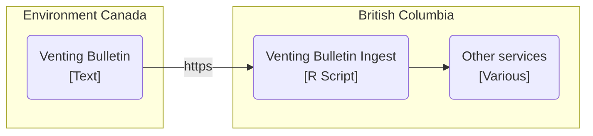
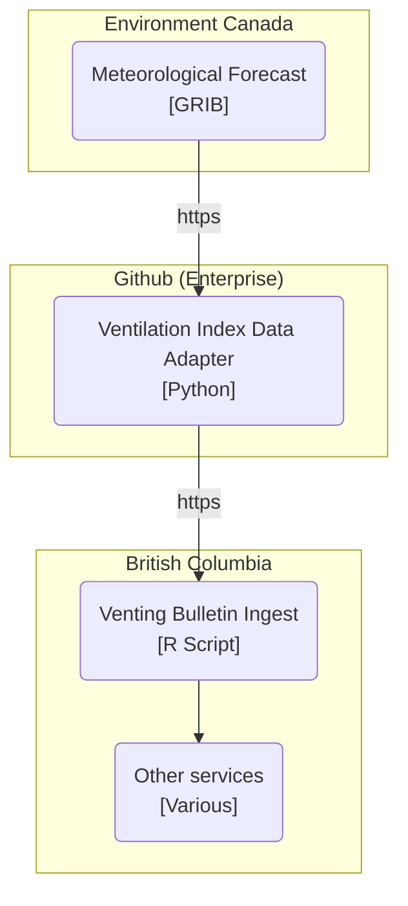
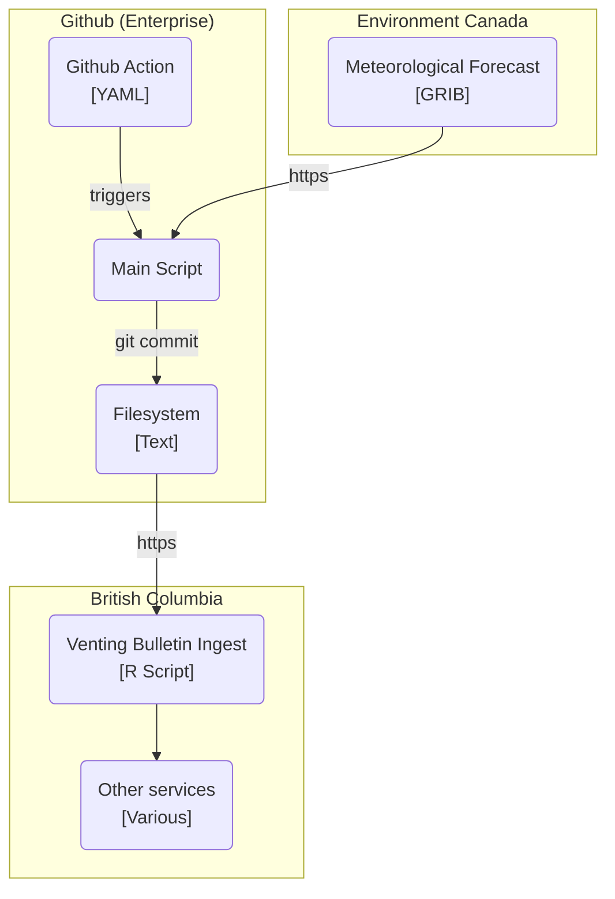
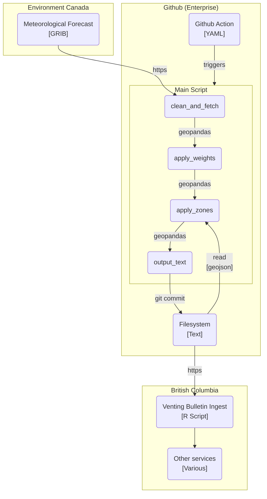

# Ventilation Index Data Adapter Infrastructure

## Context

British Columbia's ventilation index alert system is used by citizens to know
whether or not they are allowed to perform controlled burns in various regions.
Previously this data was sourced from Environment Canada's ECCC Datamart where
they post daily bulletins with forecast values. Recently, Environment Canada has
started publishing this data in much higher resolution in the World
Meteorological Organization's standard General Regularly-distributed Information
in Binary form format (GRIB). This project is a first step towards modernizing
British Columbia's capabilities by reading the GRIB data and reproducing the
original bulletin so that our systems can continue to operate. It will allow us
to produce more, and more highly detailed data in the future.

### Previous Infrastructure

### New Infrastructure

This project inserts itself between Environment Canada and our legacy systems,
and will read GRIB encoded data to produce files that our legacy systems can
use. Currently we plan to host this project directly on Github since is only
needs to be run on demand. It is not a persistent service with state.

## Containers

Once per day, a Github action will trigger a build. This build will fetch the
meteorological forecast from Environment Canada, process the data, and produce a
venting bulletin file which it will commit to the git repository giving it a
public URL. Our legacy systems can then fetch this bulletin and proceed
normally.

## Components

Once triggered, the main script will:

1. Fetch GRIB data for the current day from Environment Canada in 12, 24, and 48
   hour forecasts
    1. Perform some cleaning on the data (discard unused data).
    2. Use lat/long values to construct GeoPandas DataFrames from the data.
2. Apply weights to each point. For now each weight is 1.
3. Load Ventilation Index zone data
    1. Construct a GeoPandas DataFrame for each zone and for each forecast.
4. Produce a text file, compatible with the original venting bulletin, with the
   zone and forecast data

The main point of using GeoPandas is for its ability to filter a DataFrame using
the "within" keyword when given a geographical polygon.

